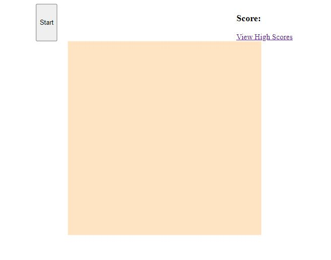
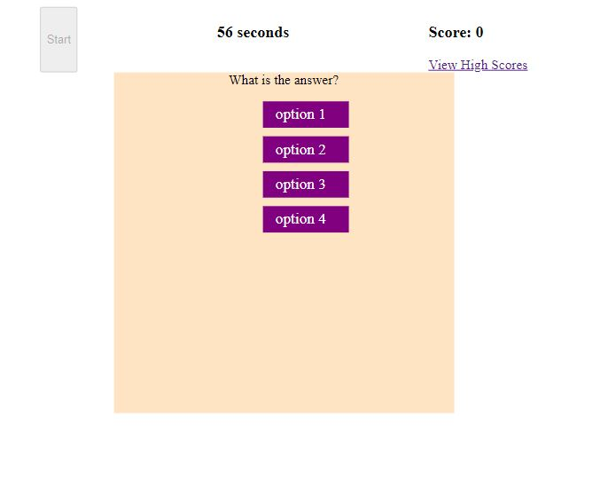
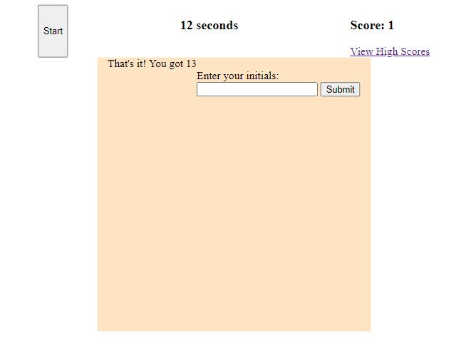
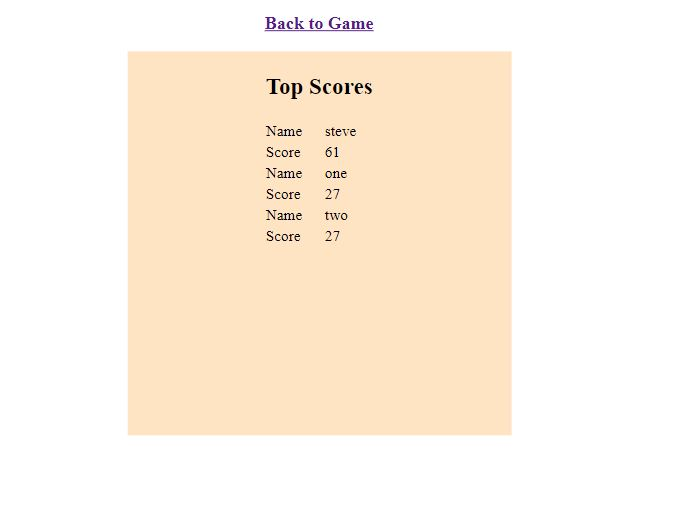

# ESMT Coding Boot Camp Homework-04

# Mini Timed Quiz with Local High Scores

## Description

This is a mini timed quiz. Upon clicking start, a 60 second timer begins counting down, and a MCQ is presented to the user. If they click correctly, they get 1 point and proceed to next question. if they click incorrectly, they are penalized 15 seconds and sent to the next question. when the timer runs down or they answer all questions in the quiz, then the timer stops and the remaining time is added to their score. they are offered the opportunity to enter their initials, and when they click submit they are redirected to the high scores page. Submit also creates a local storage object holding their score (if it didn't exist). if it existed with fewer than three scores, their score is added. If it existed with 3 or more scores, the scores are added, sorted, and the lowest is removed.

# Correct answers for dummy questions

1. option 1
2. option 2
3. option 4
4. option 3

# Link to deployed app

https://queenmcsteve.github.io/Homework_04/

# Link to repository

https://github.com/queenmcsteve/Homework_04

# Screen shots

start screen

during quiz

initial entry

high score screen with elements in local storage

